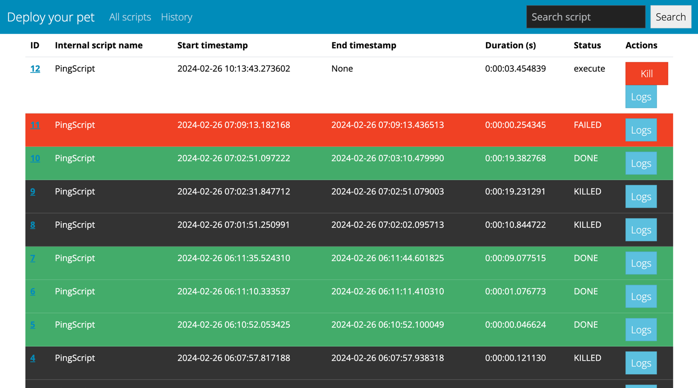

# Deploy your pet

## 1. Prepare steps
1. Install Python 3.10
2. Create and activate venv
3. Install requirements (`pip install -r requirements.txt`)
4. Change username and password in config.ini

## 2. Run application
Development mode: `python app.py`. 
For production mode use WSGI server instead (ex. gunicorn).

## 3. Add your own scripts
Scripts are located in `/scripts/` folder. 
Make a new class inherited from `BaseScript` 
and register it in `/scripts_manager.py`. 
See `/scripts/ping.py` and `/scripts/clone_repo.py` for examples.
You can use all the power of python without restriction.

### 3.1 Input fields
For passing data into a script, 
use `InputField` (`/models/input_field.py`).
Currently, there are available three different types (`InputTypes`):
- `STRING` – just a string with no validation
- `NUMBER` – integer number, can be negative
- `COUNT` – positive integer number

### 3.2 Using values from input fields
Each script has stages. 
Stage is a method with kwargs only. 
You can access input data from any stage by input field name

## 4. Additional features
### 4.1 Killing running scripts
#### Manually
When script is running, you can stop it with "Kill" button. 
**Be careful:** you will stop execution of next stage, 
but current stage will be finished!

#### Scheduled killer
Each N seconds (see `config.ini`, `ScriptsCheckSeconds`) killer check all not finished scripts.
If script is running for more than M seconds (`ScriptsTimeoutSeconds`) it will be automatically killed.
You can disable this mechanism by comment the decorator `@schedule.repeat` in `/scheduling.py`.

### 4.2 Helpers
There are some most frequently used methods in `/helpers/` directory, just check it out.